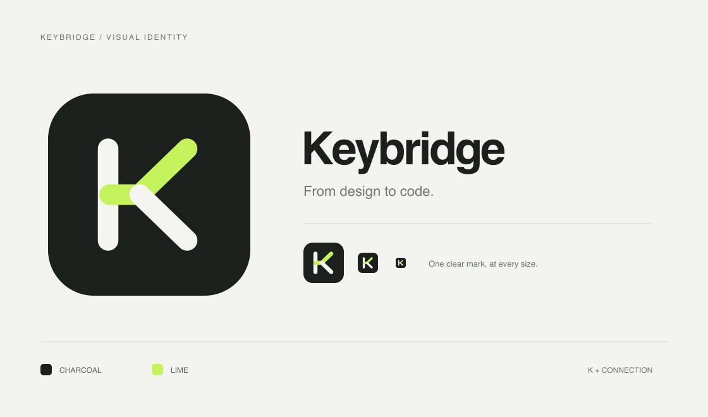

# Keybridge — Figma → Markdown → Flutter JSON



[브랜드 에셋 안내](assets/brand/README.md) · [미리보기 원본](assets/brand/brand-preview.png)

문구 검수가 끝나기 전에 개발자가 키를 연결하고 개발을 시작하는 로컬 Figma 플러그인입니다. 로컬 기능은 계정 없이 실행합니다. 선택 기능인 GitHub 연결은 사용자 토큰을 사용합니다. **v0.7.1 프로토타입**이며 실제 Figma 파일에서의 설치·동작 검증은 별도로 필요합니다.

## 구성

- `plugin/`: 바로 가져올 수 있는 플러그인 코드·UI·manifest
- `src/app.tsx`, `src/components/ui/`, `src/styles.css`: shadcn UI와 테마
- `src/catalog.cjs`: MD 형식, 병합, 검증, JSON 생성 공통 로직
- `scripts/catalog.cjs`: Node 20+ CLI, 추가 의존성 없음
- `examples/`: 검수 완료 카탈로그와 원문 변경 예제
- `docs/WORKFLOW.md`: 협업·검수·릴리스 규칙

## 1. Figma에 설치

1. 이 폴더를 팀의 Git 저장소에 넣습니다.
2. Figma 데스크톱에서 Plugins → Development → New plugin을 열어 Figma design용 플러그인을 생성합니다. 메뉴 이름은 앱 버전에 따라 다를 수 있습니다.
3. Figma가 생성한 manifest의 **실제 플러그인 ID**를 이 프로젝트 `plugin/manifest.json`의 `keybridge-local-development` 대신 입력합니다. 팀원은 같은 manifest/ID를 사용해야 같은 private plugin data를 읽을 수 있습니다.
4. 새로 만든 기본 템플릿을 실행하지 마세요. Plugins → Development → Import plugin from manifest에서 **이 프로젝트의 `figma-keybridge/plugin/manifest.json`**을 선택합니다. Figma가 방금 만든 템플릿 폴더의 manifest와 다른 파일입니다.
5. 편집 권한이 있는 테스트 파일에서 프레임을 선택하고 Keybridge를 실행합니다. 키 연결은 Figma 문서 메타데이터를 수정하므로 보기 전용 권한만으로는 이 흐름을 수행할 수 없습니다.

미리 빌드한 `plugin/ui.html`을 포함했으므로 설치에 npm install은 필요 없습니다. UI는 실제 shadcn/ui 컴포넌트·React·Tailwind로 구현했고, 실행에 필요한 코드는 HTML 안에 묶여 있어 CDN에 연결하지 않습니다. 소스를 수정할 때는 패키지 설치 후 빌드합니다.

```sh
npm ci
npm run build
npm test
```

## 2. 키 연결·MD 전달

1. 기존 `catalog.md`가 있으면 가져옵니다. 같은 문서·노드 연결을 우선하고, 없으면 원문이 유일하게 일치하는 키를 제안합니다. 제안이 같은 의미인지 직접 확인합니다.
2. Figma에서 프레임을 선택하고 **불러오기**를 누릅니다. 선택 영역 또는 현재 페이지 전체를 읽습니다. 숨겨진 레이어의 텍스트도 포함합니다.
3. **빈 키 생성**으로 접두사와 노드 ID 기반의 초안 키를 생성합니다. `screen.text_12_34`를 `checkout.payButton`처럼 의미 있는 키로 바꿀 수 있습니다.
4. **키 연결 저장**을 누릅니다. 화면에 표시된 문구는 변경하지 않고 텍스트 노드의 plugin data에 키를 저장합니다.
5. **MD 미리보기·다운로드**로 `catalog.md`를 저장합니다. 기존 MD를 가져왔다면 검수한 원문·번역은 유지하고 원문 차이는 `pendingSource`로 표시합니다.
6. 저장소의 MD와 diff를 확인하고 PR에 반영합니다. 같은 화면을 다시 처리할 때 항상 Git의 최신 MD를 가져옵니다.

새로 내보낸 MD에 기존 문구·키가 없다는 이유로 기존 카탈로그에서 삭제하지 않습니다. 프레임 일부만 내보내는 작업을 지원하기 위해서입니다.

## 3. 기존 평면 JSON 가져오기

```sh
node scripts/catalog.cjs init path/to/ko.json --locale ko --out catalog.md
```

기존 키를 보존하고 상태는 `draft`로 시작합니다. 이 명령은 기준 언어만 가져옵니다. 기존 다른 언어의 대량 마이그레이션은 v0.1에 포함하지 않았습니다. MD의 `translations`에 직접 입력할 수 있습니다.

## 4. MD를 직접 검수·번역

MD는 문서이고, 정확히 하나의 `keybridge` 코드 블록 안에 JSON 데이터를 저장합니다. 별도 YAML 패키지 없이 변환할 수 있으며 따옴표·줄바꿈을 명확하게 표현합니다. 블록 밖에는 자유롭게 설명을 추가할 수 있지만 CLI가 MD를 다시 생성하면 블록 밖 설명은 기본 안내문으로 교체됩니다. 영구 설명은 각 entry의 `description` 같은 추가 필드에 넣으세요. 기존 entry 추가 필드는 병합 시 보존합니다.

```json
{
  "key": "checkout.payButton",
  "source": "결제하기",
  "status": "approved",
  "translations": {
    "en": { "value": "Pay now", "status": "approved" }
  },
  "refs": []
}
```

- `draft`: 개발에 사용할 초안
- `approved`: 담당자가 확인한 문구/번역
- `needs-review`: 수정 후 다시 검수할 문구/번역
- `pendingSource`: Figma에서 들어온 아직 결정하지 않은 원문 변경 제안

원문을 MD에서 직접 고치면 관련 번역 상태도 직접 `needs-review`로 바꿔야 합니다. 에디터가 자동으로 검수를 무효화하지는 않습니다. 원문 변경 제안은 아래 명령으로 적용하면 번역 상태가 자동으로 무효화됩니다.

```sh
node scripts/catalog.cjs accept catalog.md --key checkout.payButton --out reviewed.md
```

검토 후 `reviewed.md`를 원본으로 반영합니다. 변경 제안을 거절하려면 `pendingSource` 필드를 제거하고 Figma 표시 문구도 담당자가 정리하세요. 플러그인이 검수 문구를 Figma에 역으로 쓰지는 않습니다.

## 5. Flutter JSON 생성

개발 중 초안 허용:

```sh
node scripts/catalog.cjs export catalog.md --out assets/translations --locales ko,en --allow-draft
```

출시 전 검사·생성:

```sh
node scripts/catalog.cjs check catalog.md --locales ko,en
node scripts/catalog.cjs export catalog.md --out assets/translations --locales ko,en
```

- 기본 모드는 요청한 언어의 모든 항목이 `approved`여야 합니다.
- 출시 명령에는 `--locales`로 필수 언어를 명시하세요. 옵션이 없으면 카탈로그에 등장하는 언어만 확인하므로 완전히 빠진 언어를 발견할 수 없습니다.
- `pendingSource`, 번역 누락, 변수 불일치는 개발 모드에서도 차단합니다.
- 현재 출력은 **평면 key-value JSON**입니다. 점이 있는 키도 문자열 그대로 유지합니다. Flutter 앱의 기존 번역 로더가 점을 중첩 경로로 해석한다면 어댑터가 필요합니다.
- `{name}` / `{{name}}` 이름 일치를 검사합니다. ICU plural/select, ARB, 중첩 JSON, printf 위치 변수는 지원하지 않습니다.
- 출력 폴더의 이전 파일을 자동 삭제하지 않습니다. 사용하지 않는 언어 파일은 Git diff에서 확인해 정리하세요.
- MD가 원본입니다. 생성된 JSON은 직접 수정하지 않습니다.

예제 실행:

```sh
npm run example
node scripts/catalog.cjs merge examples/catalog.md examples/figma-update.md --out merged.md
```

`merged.md`에서는 기존 번역이 보존되고 `pendingSource`가 생성됩니다.

## 현재 범위와 한계

- 스캔·저장 사이 다른 사용자가 바꾼 문구나 키는 재스캔을 요구합니다. Figma의 동시 편집을 위한 완전한 트랜잭션/잠금 기능은 아닙니다.
- 복제된 텍스트가 기존 메타데이터를 갖고 있다면 같은 키로 표시됩니다. 의미가 달라지면 직접 별도 키로 수정해야 합니다.
- 공통 키에 서로 다른 문구가 있는지 선택한 범위에서 검사합니다. 파일 전체·다른 파일의 공통 키 충돌을 자동 탐색하지 않습니다.
- MD를 가져오는 것은 검수·키 제안용이며 Figma 원문을 수정하거나 자동 승인하지 않습니다.
- 키 이름을 바꾸면 기존 키 삭제·앱 코드 치환까지 자동으로 하지 않습니다. 사용처를 검색하고 별도 PR에서 정리하세요.
- Figma에만 있는 버튼 외 런타임 오류/서버 메시지 등은 MD에서 직접 키를 등록합니다.
- GitHub 기능을 사용하면 선택한 저장소를 대상으로 api.github.com에 요청합니다. 로컬 MD 기능만 사용하면 자체 네트워크 요청을 하지 않습니다. 데이터는 Figma 문서 메타데이터와 사용자가 가져오고 내보낸 파일에 있습니다. Figma 자체의 클라우드 저장은 그대로 적용됩니다.
- GitHub 초안 PR 기능을 제공합니다. 웹 검수 화면과 자동 Figma 역동기화는 포함하지 않습니다.

## 검증

`npm test`: MD 왕복 변환, 검수 보존, 부분 내보내기, 재검수 전환, 출시 차단, 변수 검사, CLI 파일 생성, Figma API 모의 실행을 검사합니다. 실제 Figma에서의 UI·다운로드·권한 동작은 [수동 확인 항목](docs/WORKFLOW.md)을 진행해야 합니다.

참고: [Figma Manifest](https://developers.figma.com/docs/plugins/manifest/), [동적 페이지 로딩](https://developers.figma.com/docs/plugins/migrating-to-dynamic-loading/).

## UI 데모

`preview.html`을 브라우저에서 열면 Figma 없이 샘플 텍스트 2개로 키 생성·저장·MD 다운로드 UI를 살펴볼 수 있습니다. 실제 Figma API 대신 모의 메시지를 사용하며 실제 파일에는 영향을 주지 않습니다. `examples/catalog.md`를 가져오면 기존 키 매칭·MD 보존도 확인할 수 있습니다.

## UI 컴포넌트 출처

shadcn/ui 공식 new-york-v4 레지스트리의 Button, Input, Card, Badge, Textarea를 사용합니다. import 경로를 로컬 utils 및 Radix Slot 패키지에 맞췄습니다. 라이선스는 `SHADCN-LICENSE.md`에 포함했습니다.

## 설치 오류: “This plugin template uses TypeScript”

이 메시지는 Figma 기본 템플릿의 안내용 code.js가 실행된 경우 나타납니다. 제공한 plugin/code.js는 실행 가능한 JavaScript이며 이 오류 문구를 포함하지 않습니다. 기본 템플릿을 빌드하는 것만으로 Keybridge가 설치되지는 않습니다.

1. Figma가 생성한 템플릿 manifest.json의 실제 id를 복사합니다.
2. Keybridge의 plugin/manifest.json에서 id만 그 값으로 바꿉니다.
3. Keybridge의 plugin/manifest.json을 개발 플러그인으로 가져와 실행합니다.
4. 같은 폴더에 제공한 code.js와 ui.html이 있는지 확인합니다.

이미 등록한 템플릿 폴더를 계속 쓰려면 Keybridge의 code.js와 ui.html을 그 폴더로 복사하고, manifest도 Keybridge 버전으로 교체하되 Figma가 발급한 실제 id를 유지하세요.

## 아이콘·장식 텍스트 제외 (v0.2.1)

Material Icons/Symbols, Font Awesome 등 알려진 아이콘 폰트, Unicode Private Use 아이콘 문자, 빈 텍스트는 기본 제외합니다. 일반 텍스트를 놓치지 않도록 레이어 이름이나 한 글자라는 이유만으로 제외하지는 않습니다.

- `제외 항목 보기`를 켜면 제외 사유와 해당 텍스트를 확인할 수 있습니다.
- 각 행의 `번역 대상` 체크를 해제하면 직접 제외하고 다시 체크하면 포함합니다.
- `키 연결 저장`으로 포함/제외 선택을 Figma 노드에 보존합니다.
- 제외 항목은 빈 키 생성과 새 MD 추출에서 빠집니다. 기존 키 연결 자체는 삭제하지 않습니다.
- 기존 MD에 이미 있는 항목은 병합 시 보존합니다. 과거 내보내기에 섞인 아이콘 키는 앱 사용처를 확인한 뒤 MD에서 직접 정리해야 합니다.

## GitHub·공통 키 사용처

**GitHub** 및 **키 사용처** 탭을 추가했습니다. 설치 후 [GitHub 연결·버전 기록 안내](docs/GITHUB-AND-USAGES.md)를 확인하세요. 기본 저장소는 JaehyunYoo/figma-keybridge입니다.

## 버전별 목록과 문구 비교 (v0.4)

키 사용처 탭에서 기록된 버전을 선택하면 키·Figma 원문·사용처를 표로 볼 수 있습니다. 두 버전을 선택해 문구 변경과 사용처 차이도 비교할 수 있습니다. 데모 데이터는 `examples/version-comparison.md`를 MD 가져오기로 열어 확인하세요.

## Figma 기본 주석 (v0.7)

키 저장 시 텍스트 레이어의 기본 Annotations에 키·문구·기록 버전을 생성·갱신합니다. 독립 도형 카드와 말풍선 생성은 제거했습니다. [기본 주석 사용 안내](docs/EXPLANATION-CARDS.md)를 확인하세요.

## 키 입력 가림 수정

브라우저 기본 datalist 자동완성을 제거했습니다. 기존 키는 입력란 아래의 **기존 키에서 선택** 버튼으로 검색합니다.

## GitHub 연결 기억 (v0.7.1)

GitHub 탭의 **이 기기에 저장**을 누르면 토큰과 저장소 설정을 로컬에 저장하고 다음 실행 시 복원합니다. **연결 해제** 시 저장 데이터도 지웁니다. 같은 플러그인 ID로 업데이트하면 다시 입력할 필요가 없습니다.
